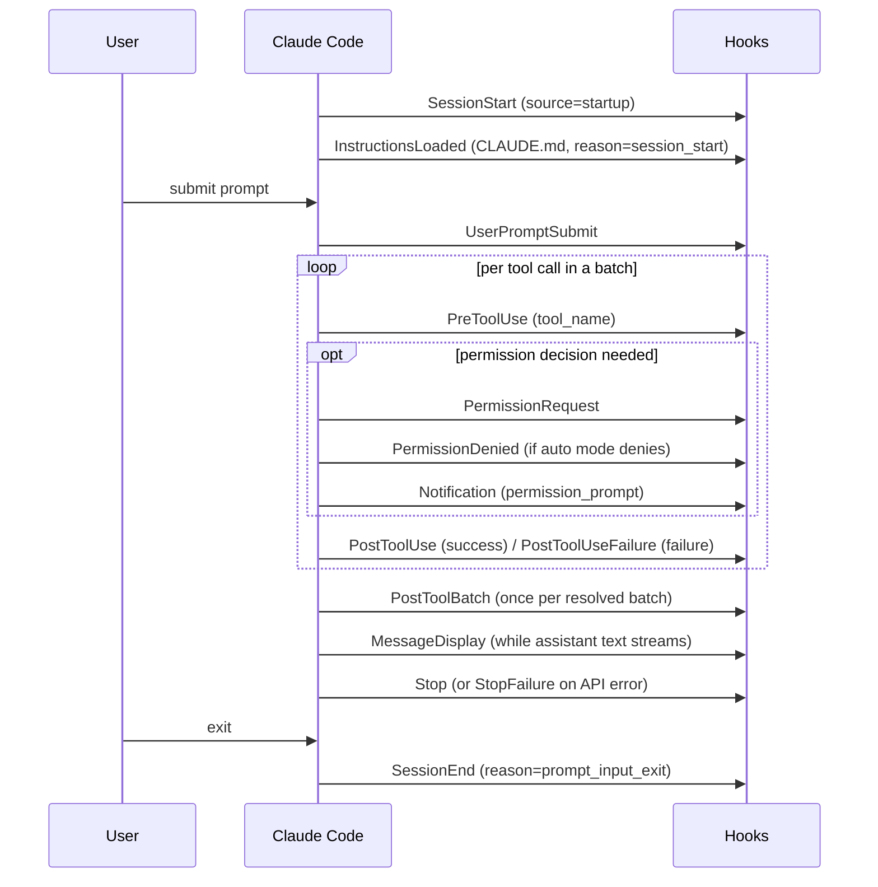
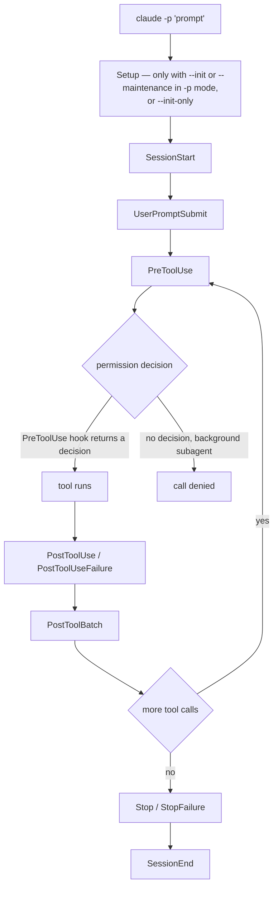
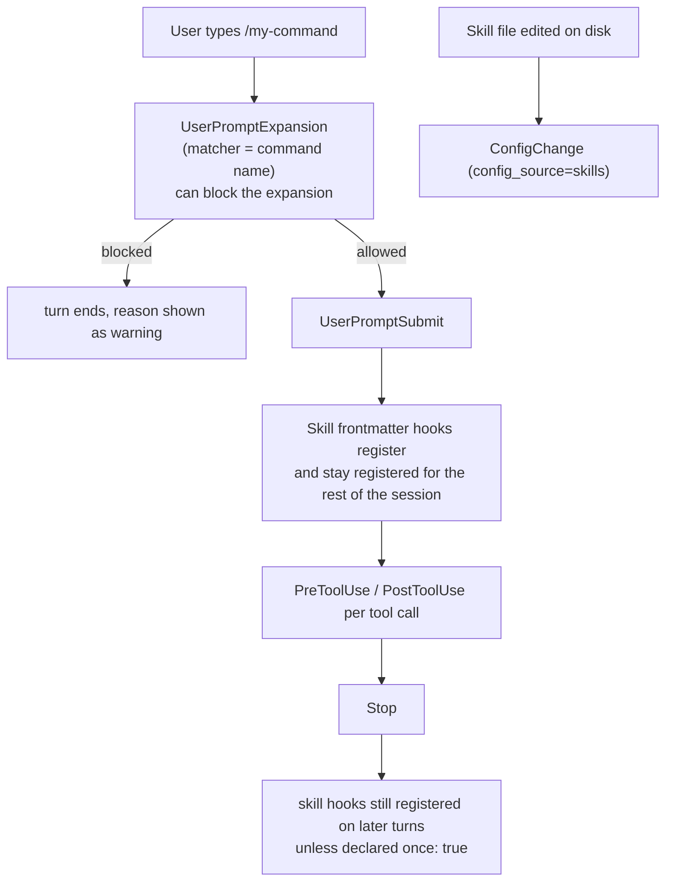

# Hook Lifecycle by Workflow Shape

**Status:** reference notes derived from documentation, not from observed hook logs.
**Date:** 2026-08-22
**Companion to:** [claude-code-integration-2026-08-22.md](claude-code-integration-2026-08-22.md)
**Implements:** [BL-0015](../backlog/BL-0015-workflow-hook-graph.md); consumed by [BL-0004](../backlog/BL-0004-hooks-events.md)

Source: the official Claude Code hooks reference (`https://code.claude.com/docs/en/hooks`) and
hooks guide (`https://code.claude.com/docs/en/hooks-guide`), fetched 2026-08-22. Event names,
matcher values, and payload fields below are taken from those pages. This repository has no
hooks configured (`.claude/settings.json` does not exist; `.claude/settings.local.json` has no
`hooks` key), so nothing here has been checked against a real event stream. Every claim that
the documentation does not state is marked **unverified** rather than guessed at.

---

## 1. The full event inventory

The documented event set is considerably larger than the nine events BL-0015 assumed. The
complete list, grouped as the reference groups it:

| Group | Events |
|---|---|
| Session | `SessionStart`, `SessionEnd`, `Setup` |
| Turn | `UserPromptSubmit`, `UserPromptExpansion`, `Stop`, `StopFailure` |
| Tool | `PreToolUse`, `PostToolUse`, `PostToolUseFailure`, `PostToolBatch`, `PermissionRequest`, `PermissionDenied` |
| Agent / task | `SubagentStart`, `SubagentStop`, `TaskCreated`, `TaskCompleted`, `TeammateIdle` |
| Context | `PreCompact`, `PostCompact` |
| File / directory | `FileChanged`, `DirectoryAdded`, `CwdChanged`, `WorktreeCreate`, `WorktreeRemove` |
| Configuration | `ConfigChange`, `InstructionsLoaded` |
| Notification / display | `Notification`, `MessageDisplay` |
| MCP elicitation | `Elicitation`, `ElicitationResult` |

Common input fields on every event: `session_id`, `transcript_path`, `cwd`, `hook_event_name`.
Conditionally present: `prompt_id` (absent until the first user input), `permission_mode`
(`default`, `plan`, `acceptEdits`, `auto`, `dontAsk`, `bypassPermissions`), `effort.level`
(`low|medium|high|xhigh|max`, present on events in tool-use context when the model supports it),
and `agent_id` / `agent_type` (present when running with `--agent` or inside a subagent).

Two structural facts drive everything below:

1. **Subagents reuse the same configured hooks.** The reference states that hooks from settings
   files, managed policy settings, and plugins "also run inside subagents", and that when a
   subagent calls a tool, `PreToolUse` and `PostToolUse` "fire the same configured hooks as in
   the main conversation", with `agent_id` and `agent_type` identifying the subagent.
2. **`Stop` is a main-thread event.** For hooks declared in subagent frontmatter, Claude Code
   "converts a `Stop` hook here to `SubagentStop`, the event it fires when a subagent completes".
   A subagent finishing therefore surfaces as `SubagentStop`, not as `Stop`.

**Unverified:** whether a subagent's tool events carry the parent's `session_id` or a distinct
one. The reference names `agent_id` as the field that distinguishes subagent calls from
main-thread calls, which implies `session_id` is shared, but it does not say so outright.

---

## 2. Shape 1 — manual interactive session

A single top-level agent, one prompt, several tool calls, one of which is denied.



| Event | Fires when | Multiplicity | Payload highlights |
|---|---|---|---|
| `SessionStart` | session begins | 1 per session start | `source` = `startup`; optional `model`; `prompt_id` absent |
| `InstructionsLoaded` | CLAUDE.md / `.claude/rules/*.md` loaded | 1 per file loaded | `file_path`, `load_reason=session_start` |
| `UserPromptSubmit` | prompt submitted, before processing | 1 per prompt | `user_prompt`, `prompt_id` |
| `PreToolUse` | before each tool call | 1 per tool call | `tool_name`, `tool_input`, `tool_use_id`, `permission_mode` |
| `PermissionRequest` | tool call needs a permission decision | 0..1 per tool call | `tool_name`, `tool_input`, `tool_use_id` |
| `PermissionDenied` | auto mode denies a call | 0..1 per tool call | `denial_reason` (optional) |
| `PostToolUse` | tool call succeeds | 1 per successful call | `tool_result`, `tool_use_id` |
| `PostToolUseFailure` | tool call fails | 1 per failed call | `error_message`, `tool_use_id` |
| `PostToolBatch` | full batch of parallel calls resolves | 1 per batch | `tool_calls[]` with `tool_name`, `tool_use_id`, `succeeded` |
| `MessageDisplay` | assistant text is displayed | many per turn (streaming) | `message_text` |
| `Stop` | Claude finishes responding | 1 per turn | `last_assistant_message`, `stop_hook_active`, `effort` |
| `StopFailure` | turn ends on an API error | replaces `Stop` on error | `error_type` (`rate_limit`, `overloaded`, ...), `error_message` |
| `Notification` | Claude Code sends a notification | 0..n | `notification_type` (`permission_prompt`, `idle_prompt`, `agent_needs_input`, ...) |
| `SessionEnd` | session terminates | 1 | matcher `reason` = `prompt_input_exit` for a normal exit |

`PostToolUse` and `PostToolUseFailure` are distinct events: a hook wired only to `PostToolUse`
does not see failed tool calls. `PostToolBatch` is the only event that expresses "the whole
parallel batch is done".

**Unverified:** the exact interleaving of `MessageDisplay` with tool events, and whether
`PostToolBatch` fires for a batch of size one.

---

## 3. Shape 2 — session spawning subagents (Agent/Task tool)

The parent's `Task`/`Agent` tool call is itself a tool call, so it produces parent-side
`PreToolUse`/`PostToolUse` in addition to the subagent's own lifecycle.

```mermaid
sequenceDiagram
    participant P as Parent session
    participant H as Hooks
    participant S as Subagent
    P->>H: PreToolUse (tool_name=Task/Agent) [no agent_id]
    P->>H: SubagentStart (agent_id, agent_type)
    opt isolation: worktree
        P->>H: WorktreeCreate (worktree_path)
    end
    S->>H: PreToolUse (agent_id, agent_type)
    S->>H: PostToolUse (agent_id, agent_type)
    Note over S,H: repeats per subagent tool call;<br/>same configured hooks as main thread
    S->>H: SubagentStop (agent_id, last_assistant_message)
    opt worktree used
        P->>H: WorktreeRemove
    end
    P->>H: PostToolUse (Task/Agent result) [no agent_id]
    P->>H: Notification (agent_completed) — background agents
    P->>H: Stop (parent turn ends)
```

| Event | Where it fires | Multiplicity | Payload highlights |
|---|---|---|---|
| `PreToolUse` / `PostToolUse` for the spawn | parent | 1 each per spawn | `tool_name` = the Task/Agent tool; no `agent_id` |
| `SubagentStart` | parent-observable | 1 per subagent | `agent_id`, `agent_type`; matcher on agent type (`general-purpose`, `Explore`, `Plan`, custom, or plugin-scoped `^plugin:name$`) |
| `PreToolUse` / `PostToolUse` / `PostToolUseFailure` | inside subagent | 1 per subagent tool call | carry `agent_id` + `agent_type` — the only way to attribute them |
| `SubagentStop` | when the subagent finishes | 1 per subagent | `agent_id`, `agent_type`, `last_assistant_message`, `stop_hook_active` |
| `WorktreeCreate` / `WorktreeRemove` | worktree-isolated subagents and background sessions | 1 each | `worktree_path` |
| `Notification` | `agent_completed`, `agent_needs_input` | 0..n | `notification_type` |
| `TeammateIdle` | agent-team teammate about to go idle | 0..n | `agent_type` |
| `Stop` | parent only | 1 per parent turn | subagents produce `SubagentStop` instead |

For N parallel subagents, expect N `SubagentStart` and N `SubagentStop`, and one `Stop` for the
parent turn that spawned them. A wave of ten fenced subagents therefore produces ten times the
tool-event volume of a manual session while producing exactly one `Stop`.

The reference also notes that background subagents cannot show a permission prompt in
non-interactive mode: Claude Code still runs the hooks for their tool calls, and if no hook
returns a decision it denies the call. In an interactive session, background subagent prompts
surface in the main session and hooks fire as usual.

**Unverified:** whether `SubagentStart` carries `prompt_id` (the reference's field list for it
omits `prompt_id`, unlike `SubagentStop`); the ordering of `SubagentStop` relative to the
parent's `PostToolUse` for the spawning call; and whether a nested subagent (a subagent that
itself spawns one) produces a nested `SubagentStart`/`SubagentStop` pair.

---

## 4. Shape 3 — headless / one-shot run (`claude -p`)



| Event | Notes for `-p` |
|---|---|
| `Setup` | fires with `--init-only`, or `--init` / `--maintenance` in `-p` mode; matcher `init` or `maintenance` |
| `UserPromptSubmit` | fires once — the `-p` argument is the prompt |
| `PreToolUse` | load-bearing here: the reference says that in `-p` mode the interactive permission prompt "only exists when the Agent SDK's `canUseTool` callback supplies it"; in plain `-p` runs or with `--permission-prompt-tool`, use `PreToolUse` hooks for automated permission decisions instead |
| `PreToolUse` decision `"defer"` | a fourth decision value available only in non-interactive `-p` mode; exits the process with the tool call preserved so an Agent SDK wrapper can collect input and resume |
| Skill frontmatter hooks | register in a `-p` run "in a folder you haven't trusted" |
| Subagent frontmatter hooks | require accepting the workspace-trust dialog; "A `-p` session doesn't count as accepting it" — so subagent-declared hooks do **not** run in `-p` |
| `Notification` | **unverified** — the documentation does not state whether `Notification` fires in headless mode |

**Unverified:** whether `SessionStart` fires with `source=startup` in a `-p` run, and what
`SessionEnd` reason a `-p` process exit reports (`other` is the plausible catch-all but the docs
do not say). Both matter for BL-0004 if headless runs are to be counted.

---

## 5. Shape 4 — resumed and compacted session

Compaction and resume share the `SessionStart` event: `source=compact` is how a post-compaction
re-entry is distinguished from `startup`, `resume`, `clear`, and `fork`.

```mermaid
sequenceDiagram
    participant CC as Claude Code
    participant H as Hooks
    Note over CC: claude --resume
    CC->>H: SessionStart (source=resume)
    CC->>H: InstructionsLoaded (load_reason=session_start)
    Note over CC: turns proceed; context fills
    CC->>H: PreCompact (compact_trigger=auto | manual)
    Note over CC: conversation summarized
    CC->>H: PostCompact (compact_trigger=auto | manual)
    CC->>H: SessionStart (source=compact)
    CC->>H: InstructionsLoaded (load_reason=compact)
    Note over CC: turns continue with compacted context
    CC->>H: SessionEnd (reason=clear | resume | logout | prompt_input_exit | other)
```

| Event | Fires when | Multiplicity | Payload highlights |
|---|---|---|---|
| `SessionStart` (`resume`) | `--resume` / `--continue` | 1 | `source=resume` |
| `SessionStart` (`fork`) | session forked from another | 1 per fork | `source=fork` |
| `SessionStart` (`clear`) | `/clear` | 1 per clear | `source=clear` |
| `SessionStart` (`compact`) | after compaction | 1 per compaction | `source=compact`; the guide's documented way to re-inject context lost to compaction |
| `PreCompact` | before compaction | 1 per compaction | `compact_trigger` = `manual` or `auto` |
| `PostCompact` | after compaction completes | 1 per compaction | `compact_trigger` |
| `InstructionsLoaded` | instruction files reloaded | 1 per file | `load_reason` = `compact` after compaction |
| `SessionEnd` | termination | 1 | `reason` ∈ `clear`, `resume`, `logout`, `prompt_input_exit`, `other` |

Note that `clear` and `resume` appear as both `SessionStart` sources and `SessionEnd` reasons —
a `/clear` produces a `SessionEnd(clear)` followed by a `SessionStart(clear)`. **A session
counter keyed on `SessionStart` alone therefore over-counts long-lived sessions**: one terminal
session that compacts twice and is cleared once emits four `SessionStart` events.

**Unverified:** the relative ordering of `PostCompact` and `SessionStart(source=compact)`. Both
are documented as firing around compaction; the reference does not state which comes first. The
diagram above shows `PostCompact` first, which is an assumption, not a documented fact. Also
unverified: whether a long-running session emits `SessionEnd`/`SessionStart` around an auto
compaction, or only the `SessionStart(compact)`.

---

## 6. Shape 5 — skill / slash-command invocation

There are two distinct paths here and the documentation distinguishes them by who typed the
command.



| Event | Fires when | Multiplicity | Payload highlights |
|---|---|---|---|
| `UserPromptExpansion` | a user-typed command expands into a prompt, before it reaches Claude | 1 per expansion | `command_name`, `expanded_prompt`; matcher is the skill/command name; can block |
| `UserPromptSubmit` | the resulting prompt is submitted | 1 | `user_prompt` |
| Skill frontmatter hooks | registered on invocation | persist for the rest of the session, including turns after the skill's own turn, unless `once: true` | same schemas as settings hooks |
| `ConfigChange` | a skills file changes during the session | 0..n | `config_source=skills`, `config_path` |

Two consequences worth noting. First, skill hooks are *sticky*: a skill invoked on turn 3 keeps
firing its hooks on turns 4..n. Any per-shape event accounting must treat skill-declared hooks
as session-scoped, not turn-scoped. Second, `UserPromptExpansion` is documented as firing "when
a **user-typed** command expands into a prompt".

**Unverified:** whether a skill invoked by the model (via the Skill tool) rather than typed by
the user also fires `UserPromptExpansion`. The wording suggests it does not — a model-invoked
skill would then appear only as `PreToolUse`/`PostToolUse` on the Skill tool — but the docs do
not address the model-invoked case explicitly.

---

## 7. Shapes BL-0015 listed that the documentation does not cover

BL-0015 also names `/loop` self-paced recurring sessions, cron-scheduled autonomous sessions,
remote/cloud sessions, and `Workflow`-orchestrated fan-outs. The hooks reference and guide do
not describe hook behavior for any of these by name. What can be said:

- A `Workflow`-orchestrated fan-out invokes agents, so it plausibly reduces to Shape 2
  (`SubagentStart`/`SubagentStop` per `agent()` call). **Unverified.**
- Scheduled and remote sessions are separate session lifecycles, so they plausibly produce their
  own `SessionStart`/`SessionEnd` pairs, possibly with `source=startup`. **Unverified** —
  neither the matcher value list nor the event list names a scheduled or remote source.
- `WorktreeCreate` / `WorktreeRemove` are documented as firing for background sessions, which is
  the one concrete hook-level signal the docs give for out-of-band work.

These should be resolved empirically once BL-0004 produces an event log, not inferred further.

---

## 8. Implications for BL-0004

BL-0004 currently plans `PostToolUse` + `SessionStart`. Measured against the five shapes above,
that pair has the following blind spots.

**What the planned pair does catch:** every successful tool call in every shape, including
subagent tool calls (they fire the same configured hooks, tagged with `agent_id`), plus a
session-start marker per shape.

**What it misses:**

| Gap | Missed shape(s) | Event to add |
|---|---|---|
| Failed tool calls are invisible — `PostToolUse` fires only on success | all shapes | `PostToolUseFailure` |
| Denied tool calls are invisible | all, and especially headless where background subagent calls are denied by default | `PermissionDenied` (and `PermissionRequest` for the ask) |
| Subagent boundaries are invisible: with `PostToolUse` alone, a wave's tool calls arrive tagged with `agent_id` but with no start/end markers, no agent type, and no result text | Shape 2 (subagent), and likely Workflow fan-outs | `SubagentStart` + `SubagentStop` |
| Turn boundaries are invisible — no way to know a turn ended, or how it ended | all shapes | `Stop` + `StopFailure` |
| Compaction is invisible, and `SessionStart` over-counts because `compact`, `clear`, and `fork` all emit it | Shape 4 | match `SessionStart` on `source` and record it; add `PreCompact`/`PostCompact` |
| Session termination is invisible, so session duration cannot be computed | all shapes | `SessionEnd` |
| Prompt boundaries are invisible, so tool calls cannot be grouped per user request | all shapes | `UserPromptSubmit`, or group by `prompt_id` which most events already carry |
| Skill/command invocations are invisible | Shape 5 | `UserPromptExpansion` |
| Parallel-batch structure is flattened | all shapes | `PostToolBatch` |

**Minimum recommended set** for an emitter that covers all five shapes without excessive volume:

`SessionStart` (recording `source`), `SessionEnd`, `UserPromptSubmit`, `PostToolUse`,
`PostToolUseFailure`, `SubagentStart`, `SubagentStop`, `Stop`, `PreCompact`.

That is nine events rather than two, and each is one more JSONL append. `PreToolUse` is
deliberately excluded from the minimum — for pure observability it doubles the tool-event volume
without adding information that `PostToolUse`/`PostToolUseFailure` lack. `MessageDisplay` should
be avoided entirely for logging: it fires while text streams, so its volume is unbounded per turn.

Two schema notes for BL-0004's JSONL line format:

- `prompt_id` is the natural correlation key for grouping events into a turn, but it is absent
  until the first user input, so `SessionStart` lines will not carry one.
- `agent_id` presence is the documented discriminator between subagent and main-thread events.
  Records should preserve `agent_id` and `agent_type` verbatim rather than deriving parentage,
  since the `session_id` relationship between parent and subagent is unverified (§1).

Finally, the ordering assumptions marked unverified in §4 (`PostCompact` vs
`SessionStart(compact)`) and §3 (`SessionStart`/`SessionEnd` behavior under `-p`) are exactly
the questions BL-0004's own log will answer first. This document should be revised against that
log rather than treated as settled.
