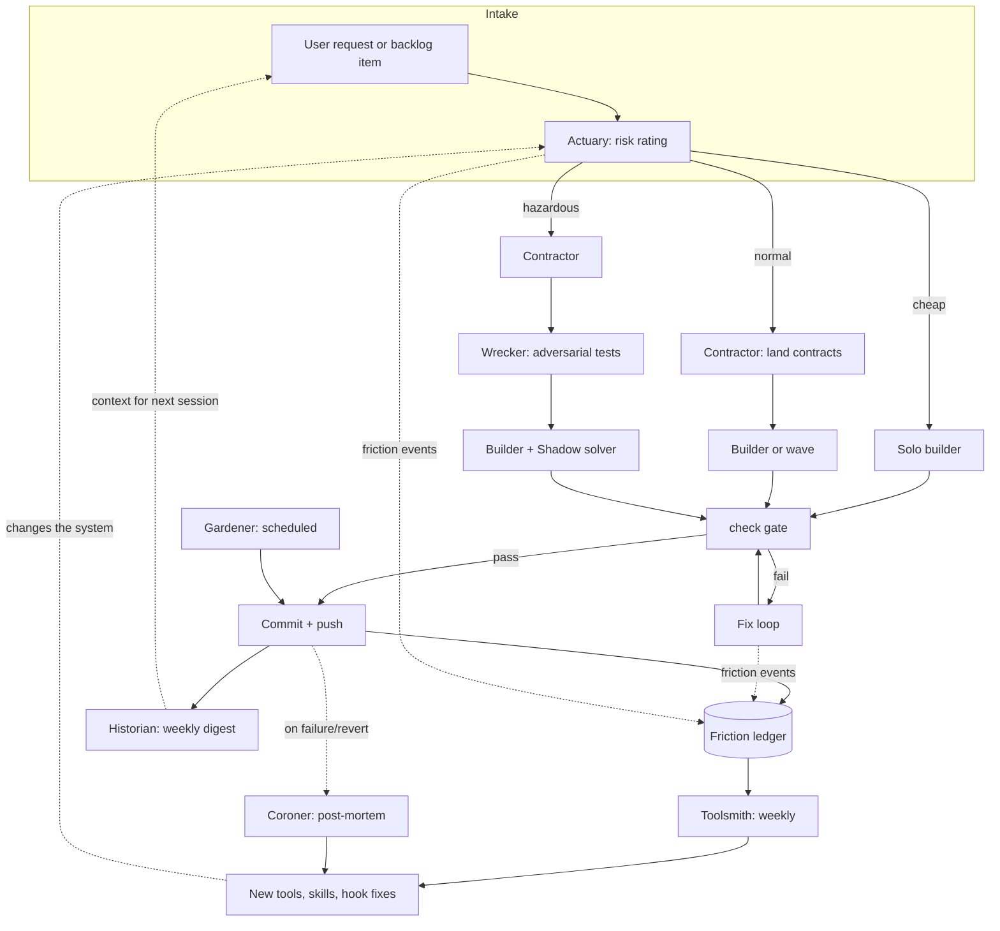
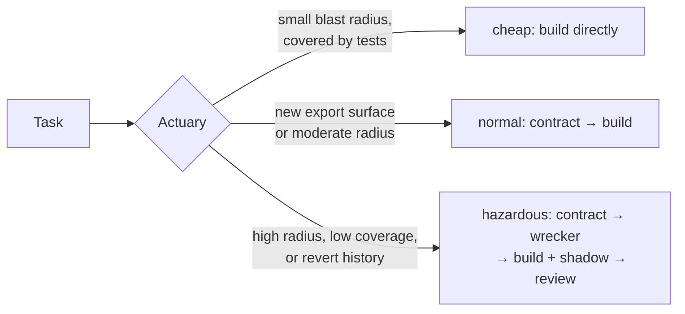
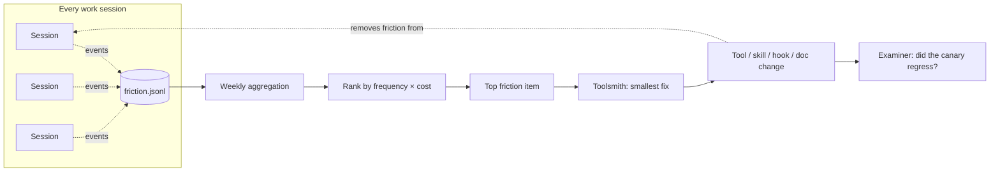
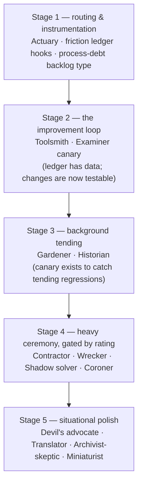

# Proposal: a self-improving agent workflow

Status: proposal. Nothing here is built. This document describes a set of agent
archetypes and feedback loops that could run on this repository, with enough detail
to judge each one before committing to it.

The design goal is compounding: each piece should make future work cheaper, and the
system should discover its own next improvement rather than waiting for a person to
notice a pattern. Three mechanisms carry that goal:

1. **Routing** — spend effort where risk is, not uniformly (the Actuary).
2. **Instrumentation** — capture friction as data, not memory (the friction ledger).
3. **Tending** — pay down entropy continuously in small commits (the Gardener).

Everything else builds on those three.

## The overall loop

Solid arrows are the per-task path. Dotted arrows are the self-improvement loop:
friction and failures become tool changes, tool changes alter how the next task runs.

## Model-tier vocabulary

Each agent below names a model tier. The tiers mean:

| Tier | Meaning | Used for |
|---|---|---|
| small | fast, cheap (Haiku-class) | mechanical work, classification, formatting |
| medium | balanced (Sonnet-class) | most building, reviewing, writing |
| large | strongest available (Opus-class) | judgment calls, adversarial work, post-mortems |

The rule of thumb: pay for judgment, not for typing. Anything with a checkable
output (the gate catches mistakes) can run a tier lower than anything whose output
is trusted directly.

---

## Part 1 — Builders and shapers

### Contractor

**What it does.** Writes only exported type signatures, interfaces, and test stubs
for a feature — never function bodies. Its output is deliberately incomplete: a
compiling skeleton that fails its own tests.

**How it works.** Takes the feature framing, reads the target package's existing
exports, and emits (a) new or changed declarations with doc comments, (b) test
files whose assertions describe the intended behavior but whose subjects throw
`not implemented`. The typecheck gate passes; the test gate fails by design until
a builder fills the bodies.

**Triggered when** a task adds or changes an export surface, or when work will be
split across parallel tracks (the contract is the fence).

**Skipped when** the change is internal to one file, or purely a fix to existing
behavior with no signature change. Running it there just adds a handoff.

**Model:** medium. The hard part is naming and shaping the surface; bodies are
someone else's problem.

| Benefits | Costs | Risks |
|---|---|---|
| Implementers work against a fixed surface; parallel tracks can't drift | One extra agent run and handoff per feature | A bad contract is expensive — everything downstream builds on it |
| Contracts get reviewed before any body exists, when changing them is free | Feels slow on small tasks (hence the skip rule) | Contractor may over-design surfaces nobody asked for |

### Miniaturist

**What it does.** Takes one working function and produces the smallest equivalent —
fewer statements, fewer escape hatches, same behavior. Never adds capability.

**How it works.** Picks its target from the size-distribution stats (largest
functions in the hottest files) or from a clone report. Rewrites, runs the full
gate, and additionally diffs test coverage to confirm nothing silently stopped
being exercised. Commits one function per commit so each shrink is independently
revertable.

**Triggered by** a schedule (weekly), or on demand against a named symbol.

**Skipped when** the target has no covering test — shrinking untested code is
refactoring blind. Instead it files a backlog item asking for the test first.

**Model:** medium, because equivalence-preserving rewriting is where mid-tier
models are strong and the gate catches the failures.

| Benefits | Costs | Risks |
|---|---|---|
| Ratchet moves the right direction without anyone scheduling refactors | Steady background token spend | "Smaller" can mean "cleverer"; needs a readability check, not just a size check |
| One-function commits are trivially reviewable | Review time for a stream of small diffs | Behavior differences the tests don't cover slip through |

### Wrecker

**What it does.** Before a feature is built, writes the tests that *should* fail
against the naive implementation: edge cases, boundary values, the inputs the spec
author didn't think about. Adversarial test authoring as a separate role.

**How it works.** Reads the contract (from the Contractor) and the framing, and is
prompted explicitly to break it: "assume the implementer will do the laziest thing
that passes the happy path — write tests that catch that." Its tests land alongside
the contract stubs before any body is written, so the implementer cannot write
tests that flatter the code.

**Triggered when** the Actuary rates a task hazardous, or when the contract touches
parsing, concurrency, or anything with a documented history of regressions.

**Skipped for** cheap-rated tasks and pure refactors, where existing tests already
define behavior.

**Model:** large. Imagining failure modes is judgment work; a weak Wrecker just
restates the happy path with different numbers.

| Benefits | Costs | Risks |
|---|---|---|
| Separates "what should be true" from "what I built," the core testing conflict of interest | Large-model spend per hazardous task | May write tests for behavior nobody intended, forcing pointless work |
| Failure cases get named before code exists, when fixing the design is cheap | Slows the start of hazardous work | Over-testing internals can fossilize implementation details |

---

## Part 2 — Skeptics and auditors

### Actuary

**What it does.** Rates every incoming task before work starts and routes it:
**cheap** (solo builder, no ceremony), **normal** (contract first, then build), or
**hazardous** (contract, Wrecker, builder plus shadow solver, mandatory review).

**How it works.** Purely from existing signals — no new analysis. It reads the
blast radius of the files the task will touch, escape-hatch density there, test
coverage of the seam, and how often those files appear in past reverts. It emits
one line: the rating and the two strongest reasons. The rating is recorded in the
backlog item's frontmatter, so the routing decision is auditable later.

**Triggered on** every task that will edit source. Always.

**Skipped for** docs-only and backlog-only changes.

**Model:** small. It is a classifier over metrics that already exist; the value is
in running it every time, cheaply, not in deep reasoning.

| Benefits | Costs | Risks |
|---|---|---|
| Effort tracks risk instead of being uniform; ceremony stops taxing small tasks | Nearly free per task | Systematic under-rating quietly removes safeguards — the Coroner must audit its calls after failures |
| Ratings accumulate into a risk map of the codebase | Building the initial scoring rules | Over-rating makes everything hazardous and the ceremony meaningless |

### Coroner

**What it does.** Runs only after something went wrong: a reverted commit, a
production bug, a gate that passed when it shouldn't have. Writes a short
post-mortem answering exactly two questions: *what signal existed beforehand*, and
*which gate or agent should have caught it*.

**How it works.** Reads the failing change, the transcript of the session that
produced it, and the Actuary's original rating. The output is a one-page ruling in
`docs/decisions/` style plus, when a gate gap is identified, a concrete backlog
item for the Toolsmith ("the check gate should have flagged X"). Failures become
gate improvements instead of anecdotes.

**Triggered by** a revert, a bug traced to a specific change, or an Actuary rating
that proved badly wrong in either direction.

**Skipped for** failures with no lesson — flaky external dependencies, one-off
mistakes with no plausible gate. Writing post-mortems for noise trains everyone to
ignore them.

**Model:** large. Root-cause analysis across a transcript, a diff, and the gate
configuration is the most judgment-heavy job in this document.

| Benefits | Costs | Risks |
|---|---|---|
| The gate system learns from every real failure | Rare, so total cost is low | Hindsight bias: everything looks catchable afterward; the "what signal existed" question must be answered honestly |
| Audits the Actuary, closing that loop | Requires keeping transcripts around | Post-mortem fatigue if the skip rule is ignored |

### Archivist-skeptic

**What it does.** Reads doc comments and design docs and tries to *falsify* them
against the code. A claim it can verify is left alone. A claim it can refute is
flagged with the evidence. A claim it can neither verify nor refute is flagged as
unverifiable. It never rewrites — flagging is the whole job, matching the house
rule that an honest gap beats a wrong doc.

**How it works.** Walks documented exports, and for each claim in the comment,
looks for the body, call site, or test that supports it. Output is a short report:
file, claim, verdict, evidence. Refuted claims become small fix tasks; unverifiable
ones become "document or delete" decisions for a person.

**Triggered on** a schedule (monthly), or against a package after heavy churn.

**Skipped for** generated docs — those are the generator's problem, and the check
gate already covers their freshness.

**Model:** medium, run wide. Each individual claim-check is small; coverage
matters more than depth.

| Benefits | Costs | Risks |
|---|---|---|
| Docs stay trustworthy, which is the only reason to have them | A recurring wide read of the codebase | False refutations erode trust in the skeptic itself; verdicts must cite evidence |
| Surfaces claims that were never true, not just ones that rotted | Someone must triage the flags | Flag volume without triage becomes wallpaper |

---

## Part 3 — Meta agents (the self-improving core)

### The friction ledger

Not an agent — the substrate the meta-agents feed on. An append-only event log
(one JSONL file, say `state/friction.jsonl`) written by **instrumentation, not
discipline**: hooks and tool wrappers emit events; agents are never asked to
remember to log.

Events worth capturing:

| Event | Emitted by | Signal |
|---|---|---|
| `fallback_to_grep` | MCP tool wrapper, when a search tool returns nothing and the agent greps next | a tool coverage gap |
| `gate_retry` | check gate, when the same failure class repeats within a session | an unclear rule or a missing earlier signal |
| `hook_refusal` | PreToolUse guards | either working guards or a guard fighting legitimate work — frequency distinguishes them |
| `doc_reread` | read tooling, when the same file is read 3+ times in one session | a doc that doesn't answer its question |
| `long_tail_task` | session end, when turns far exceeded the Actuary's estimate | mis-rating or hidden complexity |

The ledger is data with exactly one consumer:

### Toolsmith

**What it does.** The only agent allowed to write MCP tools, skills, and hooks.
Its backlog is generated from the friction ledger, not requested by people.
Concentrating meta-work in one role keeps the toolset coherent — one author's
taste instead of everyone's side hobby.

**How it works.** Weekly: aggregate the ledger, rank recurring friction by
frequency × cost, take the top item, and ship the smallest change that removes it
— a new tool, a doc fix, a hook adjustment, or a gate rule. One improvement per
cycle, landed as a normal reviewed change that itself passes the gate. Before
shipping a new tool it must show the ledger evidence: "this pattern occurred N
times across M sessions."

**Triggered** weekly, or immediately when the Coroner files a gate gap.

**Skipped when** the week's top friction item occurred fewer than a threshold
number of times. No evidence, no tool — this is the guard against speculative
tooling.

**Model:** large for design decisions, medium for implementation.

| Benefits | Costs | Risks |
|---|---|---|
| The toolset grows from measured pain, not roadmap guesses | Ledger infrastructure up front; a weekly cycle forever | Local fixes accumulating into an incoherent toolset — the architect reviews its designs |
| One accountable owner for all meta-machinery | | Overfitting to last week's tasks; the frequency threshold is the defense |

### Examiner

**What it does.** Tests the agents, not the code. Two halves: a **canary
benchmark** — a fixed set of representative tasks (find a symbol, extract a clone,
fix a diagnostic, rate a task) re-run against the current toolset and prompts —
and **transcript grading** — after-the-fact scoring of real sessions against
process rules (did the scout run, were doc rules followed, did the agent thrash).

**How it works.** The benchmark reports success rate, turns-to-completion, and
token cost per task, appended to a dated results file so trends are visible.
Grading samples a few transcripts per week against a rubric and emits scores plus
the single worst pattern observed. Both feed the Toolsmith: a canary regression
after a tool change is a revert signal; a recurring grading failure is a friction
item.

**Triggered:** benchmark after any change to tools, skills, hooks, or agent
prompts, and on a monthly heartbeat; grading weekly on a sample.

**Skipped:** benchmark for source-only changes that touch no agent machinery.

**Model:** small for running the benchmark, medium for grading transcripts.

| Benefits | Costs | Risks |
|---|---|---|
| Tool and prompt changes get a regression test — nothing else in this document is safe without it | Maintaining the task set as the repo evolves | Goodhart: agents (and the Toolsmith) optimizing for the benchmark rather than real work — refresh tasks periodically |
| Trend data answers "are the agents getting better?" with numbers | Benchmark runs cost tokens | Synthetic tasks miss messy-session failures — which is why grading exists |

### Historian

**What it does.** Maintains a running narrative of the repository: a weekly digest
of what landed, what was decided, what was reverted, and how the trend lines
(ratchet count, function-size distribution, clone count, backlog throughput) moved.
Its product is **context**: a new session reads the latest digest instead of
re-deriving state from the git log.

**How it works.** Reads the week's commits, decision rulings, Coroner reports, and
metric snapshots. Writes one page, hard-capped, in plain prose. Keeps a rolling
"state of the repo" summary (also one page) that the digest amends. Contradictions
it notices — a ruling that says X while three commits do Y — are flagged, not
resolved; resolution belongs to the architect.

**Triggered** weekly, plus a short addendum after any multi-agent wave.

**Skipped** in quiet weeks below a minimum commit count; a digest of nothing
trains readers to skip digests.

**Model:** medium. Summarization with a strict length budget.

| Benefits | Costs | Risks |
|---|---|---|
| Cold-start context for every session; drift becomes visible as a story | Weekly read of commits and metrics | Narrative can smooth over inconvenient facts; digests must link their evidence |
| Cheap institutional memory that survives context windows | | If it grows past one page it stops being read — the cap is load-bearing |

### Gardener

**What it does.** Tends. Prunes unused exports, fixes stale index tables, closes
backlog items whose code has vanished, deletes long-dead flagged docs, normalizes
formatting drift. Never anything requiring judgment about behavior.

**How it works.** Runs on a schedule with a fixed, whitelisted task menu. Each
tending action is one small commit, gated like any other change. Anything
ambiguous — an unused export that might be a public seam — is filed as a question,
not deleted. The whitelist is the safety mechanism: the Gardener's judgment is
never trusted, only its diligence.

**Triggered** nightly or weekly, unattended.

**Skipped when** the working tree is dirty or a wave is in flight — the Gardener
never races active work.

**Model:** small. The whole point is that this work needs no judgment.

| Benefits | Costs | Risks |
|---|---|---|
| Entropy paid down continuously; the compounding value of a hundred boring commits | Very low per run | Automated deletion is the sharp edge — the whitelist plus one-commit-per-action plus the gate keep every mistake small and revertable |
| Frees every other agent from janitorial guilt | Commit-stream noise (mitigable with a tag) | |

---

## Part 4 — Situational agents

Cheap, sharp-edged roles that run at specific moments rather than on the main path.

**Shadow solver.** For hazardous-rated tasks only: a second agent solves the same
task blind to the first solution. The diff between solutions is the product —
agreement raises confidence, divergence pinpoints exactly where the design is
contentious. The better approach (fewer escape hatches, smaller) gets written into
a cookbook of solved-problem patterns that future builders read. *Skipped* below
hazardous rating: doubling cost on routine work buys marginal cookbook entries.
Model: medium (deliberately different in temperament from the primary builder, if
the runtime allows).

**Devil's advocate.** Before an architect ruling lands, argues the opposite
position in ten lines or fewer. Rulings that survive get marked *contested and
upheld*, which future agents can weight above uncontested ones. *Skipped* for
rulings that merely record an existing fact. Model: large, briefly — a weak
counter-argument is worse than none because it launders the ruling as "contested."

**Translator.** A prose gate parallel to the code gates: rewrites agent output
that violates the house style (coined terms, narration, jargon) before it reaches
docs or the user. *Skipped* for code and generated content. Model: small. Risk:
over-normalizing until everything reads the same; it fixes violations, it does not
impose a voice.

**Quartermaster.** Pre-wave check: verifies each parallel track's claimed file
fences against the actual module graph and refuses tracks whose fences are
fictional (two tracks that both transitively edit the same seam). The cheapest
possible insurance against the worst wave failure mode — agents clobbering each
other. *Runs* before every wave; skipped otherwise. Model: small — it is a graph
query with a veto.

---

## Sequencing

Dependencies, not dates. Each stage should prove itself before the next is built:

Stage 1 is nearly free and generates the evidence that decides whether the rest is
worth building. If the friction ledger stays empty and the Actuary's ratings are
all "cheap," stop there — that is also a finding.

## Failure modes of the whole system

Worth naming beyond the per-agent risks:

- **Process weight.** Every archetype adds latency to something. The Actuary's
  routing exists precisely so that most tasks feel none of it; if cheap-rated
  tasks ever accumulate ceremony, the system has failed its own test.
- **Self-reference collapse.** A system that improves itself can also degrade
  itself — a bad Toolsmith change makes every future session slightly worse. The
  Examiner's canary is the only brake; it must exist before the Toolsmith ships
  anything.
- **Report rot.** Historians, skeptics, and examiners all produce documents. Any
  report stream without a consumer and a length cap becomes wallpaper within a
  month. Every report in this design has a named consumer and a size limit; keep
  it that way.
- **Metric gaming.** Ratchet counts, benchmark scores, and size stats are all
  gameable by the agents they measure. Periodic refresh of the benchmark and human
  spot-checks of "improved" code are the countermeasures.
